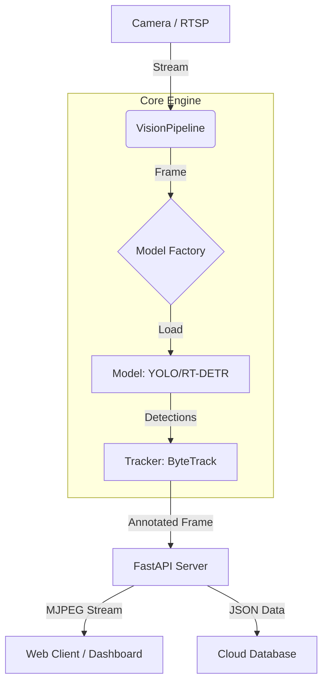

# 👁️ Unbreakable Eye
> **Production-Grade Edge AI Inference Microservice**

[](https://github.com/mralamdari/unbreakable-eye/actions)


**Unbreakable Eye** is a hardware-agnostic computer vision pipeline designed for scalability and reliability. It decouples the model logic from the application layer, allowing hot-swapping of inference engines (YOLOv8, YOLOX, RT-DETR, OpenVINO) without code changes.

---

## ⚡ Key Features

*   **🏭 Universal Factory Pattern:** Plug-and-play support for Ultralytics, ONNX Runtime, and OpenVINO backends.
*   **🐳 Docker Native:** Multi-stage build (under 500MB) optimized for Edge deployment (Jetson/RPi) and Cloud (AWS/GCP).
*   **🛡️ Robust Config:** Strictly typed configuration using Pydantic Settings (The 12-Factor App methodology).
*   **📡 Async Streaming:** Low-latency MJPEG streaming and JSON metadata endpoints via FastAPI.
*   **📊 Observability:** Structured JSON logging (Loguru) ready for Datadog/ELK stacks.

---

## 🏗️ Architecture



---

## 🚀 Quick Start

### Option A: Docker (Recommended)
The system is ready to run in any container runtime.

```bash
# 1. Build the image
docker build -f infra/docker/Dockerfile -t unbreakable-eye .

# 2. Run the container (with GPU support if available)
docker run -it -p 8000:8000 --env-file .env unbreakable-eye
```

### Option B: Local Development
```bash
# 1. Install Dependencies (Poetry)
pip install -e .

# 2. Configure Environment
cp .env.example .env
# Edit .env to set your RTSP_URL and MODEL_TYPE

# 3. Start Server
python -m src.server.main
```

---

## 🔧 Configuration
Control the pipeline via Environment Variables (`.env`). No code changes required.

| Variable | Default | Description |
| :--- | :--- | :--- |
| `RTSP_URL` | `0` | Camera URL (rtsp://...) or Webcam ID |
| `MODEL_ARCH` | `yolov8` | Engine to use: `yolov8`, `yolox`, `rtdetr`, `openvino` |
| `DEVICE` | `cpu` | Hardware accelerator: `cpu`, `cuda`, `gpu` |
| `LOG_JSON` | `False` | Set `True` for production JSON logs |

---

## 📂 Project Structure
```text
unbreakable-eye/
├── infra/              # DevOps (Docker, K8s, Terraform)
├── src/
│   ├── core/           # Config & Logging (The Brain)
│   ├── engine/         # Pipeline & Tracker (The Heart)
│   ├── vision/         # Model Factory & Handlers (The Eyes)
│   └── server/         # API & Routers (The Mouth)
└── pyproject.toml      # Dependency Management
```

---

## 📜 License
MIT License.
```
