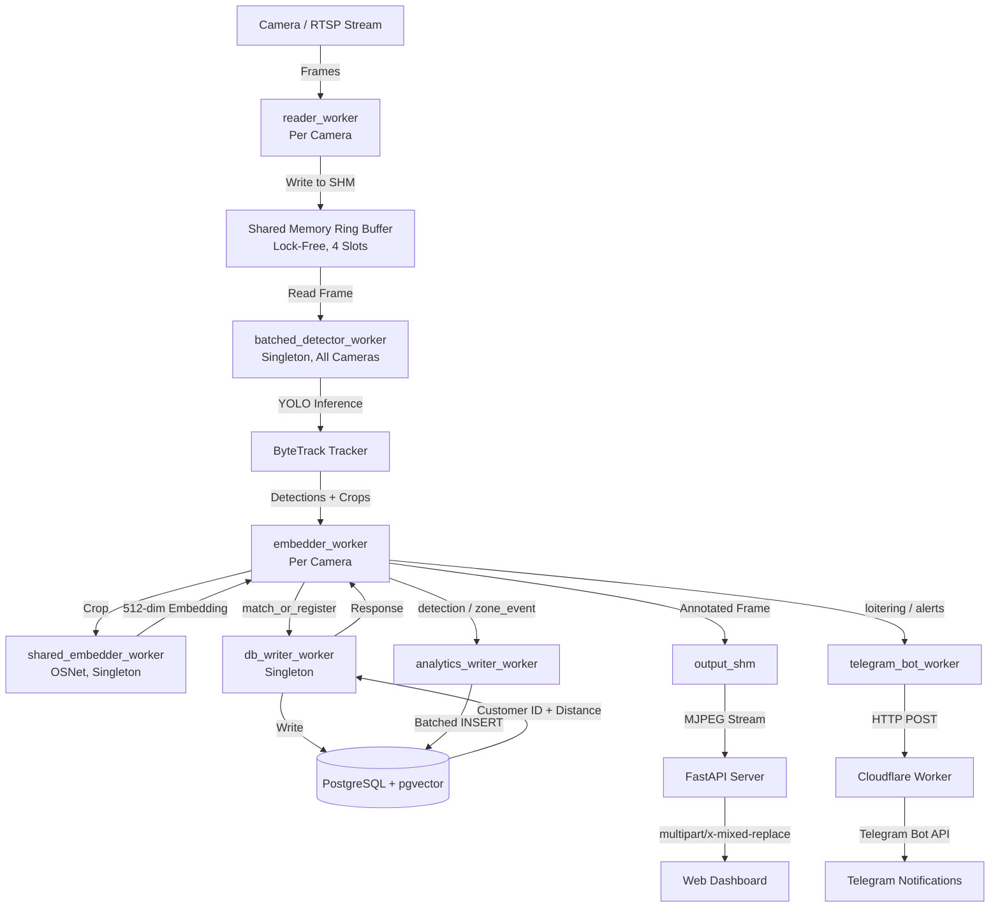

# Unbreakable Eye

> Production-Grade Edge AI Inference Microservice for Real-Time Computer Vision

[](https://github.com/mralamdari/unbreakable-eye/actions)


[](LICENSE)
[](CONTRIBUTING.md)

https://github.com/user-attachments/assets/00000000-0000-0000-0000-000000000000
<!-- TODO: Replace the line above with your demo GIF path. Example:

-->

**Unbreakable Eye** is a hardware-agnostic computer vision pipeline for real-time retail and shop surveillance. It captures live video from IP cameras (RTSP) or USB webcams, runs deep learning object detection and tracking, performs person re-identification (Re-ID) across cameras and sessions, and provides a full analytics dashboard with Telegram alerting -- all self-hosted and deployable on anything from a Raspberry Pi to an NVIDIA GPU server.

The core design principle is **decoupled model logic**: the inference backend is swapped at configuration time via a factory pattern, with zero code changes. YOLOv8, YOLOX, RT-DETR, D-FINE, and OpenVINO all work through the same pipeline.

---

## Key Features

- **6 Interchangeable AI Backends** -- YOLO ONNX, Ultralytics PyTorch, YOLOX, RT-DETR, D-FINE, and Intel OpenVINO, all swappable via a single env var
- **Person Re-Identification** -- OSNet embeddings (512-dim) with pgvector similarity search; recognizes returning visitors across cameras and sessions
- **Multi-Process Shared-Memory Pipeline** -- Zero-copy frame passing via `multiprocessing.shared_memory` ring buffer; batched inference across all cameras
- **Real-Time Web Dashboard** -- MJPEG live video wall (1-9 cameras), zone drawing overlay, analytics charts (footfall, occupancy, dwell, heatmaps, peak hours, repeat visitors)
- **Zone Analytics** -- Draw polygon zones per camera; track dwell time, loitering, entry/exit events, and per-zone performance
- **Telegram Alerting** -- Loitering, camera offline, occupancy limit, and zone alerts via a Cloudflare Worker relay (free tier, no server needed)
- **Hardware-Agnostic Deployment** -- 5 Dockerfiles and 5 docker-compose variants for x86, NVIDIA GPU, NVIDIA Jetson, Raspberry Pi, and development
- **Privacy Mode** -- Optional GDPR-compliant Gaussian blur on detected person regions
- **Rolling Heatmaps** -- Density heatmaps with exponential decay and JET colormap overlay on the video feed
- **Structured Logging** -- Loguru with JSON or colored text output, ready for Datadog/ELK stacks

---

## Architecture

### Data Flow

The system is a multi-process pipeline connected by shared memory and queues:


```mermaid
graph TD
    A[Camera / RTSP Stream] -->|Frames| B[reader_worker<br/>Per Camera]
    B -->|Write to SHM| C[Shared Memory Ring Buffer<br/>Lock-Free, 4 Slots]
    C -->|Read Frame| D[batched_detector_worker<br/>Singleton, All Cameras]
    D -->|YOLO Inference| E[ByteTrack Tracker]
    E -->|Detections + Crops| F[embedder_worker<br/>Per Camera]
    F -->|Crop| G[shared_embedder_worker<br/>OSNet, Singleton]
    G -->|512-dim Embedding| F
    F -->|match_or_register| H[db_writer_worker<br/>Singleton]
    H -->|Write| I[(PostgreSQL + pgvector)]
    I -->|Customer ID + Distance| H
    H -->|Response| F
    F -->|Annotated Frame| J[output_shm]
    J -->|MJPEG Stream| K[FastAPI Server]
    K -->|multipart/x-mixed-replace| L[Web Dashboard]
    F -->|detection / zone_event| M[analytics_writer_worker]
    M -->|Batched INSERT| I
    F -->|loitering / alerts| N[telegram_bot_worker]
    N -->|HTTP POST| O[Cloudflare Worker]
    O -->|Telegram Bot API| P[Telegram Notifications]
```

### Multi-Process Architecture

```
                          +-------------------------------------------+
                          |       FastAPI Process (main)              |
                          |  HTTP server, auth, template rendering    |
                          |  MJPEG streaming (generate loop)          |
                          +----+----------+-----------+--------------+
                               |          |           |
                    multiprocessing.spawn  |           |
               +----------------+    +-----+------+    +------------------+
               | db_writer      |    | analytics  |    | telegram_bot     |
               | (1 process)    |    | _writer    |    | (1 process)      |
               | Embedding      |    | (1 proc)   |    | Alert listener   |
               | cache + CRUD   |    | Batched    |    | Daily/weekly     |
               +----------------+    | INSERT     |    | reports          |
                                     +------------+    +------------------+

    Per Camera (N cameras):
    +--------------------------------------------------+
    |  VisionPipeline                                  |
    |  +----------+   +----------------+               |
    |  | reader   |-->| frame_ready_q  |--> batched_detector
    |  | (1/cam)  |   | (shared queue) |   (1 process, all cams)
    |  +----------+   +----------------+       |
    |       |              det_queue           |
    |       v                v                 v
    |  +----------+   +-------------+   +--------------+
    |  | SHM ring |   | embedder    |-->| shared       |
    |  | buffer   |   | (1/cam)     |   | embedder     |
    |  +----------+   +-------------+   | (1 process,  |
    |                                    |  all cams)   |
    |                                    +--------------+
    +--------------------------------------------------+
```

### Component Layers

The codebase follows a clean four-layer architecture:

| Layer | Directory | Role | Key Components |
|-------|-----------|------|----------------|
| **The Brain** | `src/core/` | Infrastructure | Config, DB connection pool, schema init, embedding cache, structured logging, exceptions |
| **The Eyes** | `src/vision/` | AI/Model | Factory pattern, 5 detector backends, model resolver (auto-download), ONNX session management, preprocessing |
| **The Heart** | `src/engine/` | Pipeline/Logic | Multi-process pipeline, ByteTrack tracker, zone manager, heatmap accumulator, loitering detection, alerts |
| **The Mouth** | `src/web/` | API/Presentation | FastAPI app, auth, MJPEG streaming, Jinja2 templates, analytics API, frontend static assets |

---

## Tech Stack

| Layer | Technology |
|-------|------------|
| **Web Framework** | FastAPI + Uvicorn (async) |
| **AI Inference** | ONNX Runtime (primary), Ultralytics (PyTorch optional), OpenVINO (Intel optional) |
| **Object Detection** | YOLOv8, YOLOX, RT-DETR, D-FINE (all via ONNX) |
| **Object Tracking** | ByteTrack (via `supervision` library) |
| **Person Re-ID** | OSNet (OSNet_x1_0 / OSNet_x0_25) via ONNX Runtime |
| **Database** | PostgreSQL 16 + pgvector (HNSW vector similarity search) |
| **DB Driver** | psycopg2 (connection pooling, RealDictCursor) |
| **Configuration** | Pydantic Settings + `.env` (12-Factor App methodology) |
| **Logging** | Loguru (structured JSON or colored text, rotating file) |
| **Image Processing** | OpenCV (headless), Pillow, NumPy |
| **Auth** | bcrypt (passlib) + itsdangerous (session signing) |
| **Package Management** | Poetry (`pyproject.toml`) + pip `requirements.txt` |
| **Templates** | Jinja2 (server-rendered HTML) |
| **Frontend** | Vanilla JS + CSS (dark theme, responsive grid, Chart.js for analytics) |
| **Containerization** | Docker multi-stage builds, Docker Compose |
| **Reverse Proxy** | Nginx Alpine (static files, MJPEG proxying) |
| **Notifications** | Telegram Bot API via Cloudflare Worker relay |
| **CI/CD** | GitHub Actions (Ruff linting, MyPy type checking) |

---

## Project Structure

```text
unbreakable-eye/
├── src/                            # Main Python application
│   ├── core/                       # "The Brain" -- config, DB, logging, exceptions
│   │   ├── config.py               # Pydantic Settings (all env vars, enums)
│   │   ├── database.py             # PostgreSQL + pgvector, schema, embedding cache, CRUD
│   │   ├── db_writer.py            # Singleton DB writer process (command dispatch)
│   │   ├── analytics_writer.py     # Batched analytics persistence + hourly aggregation
│   │   ├── logging.py              # Loguru setup, stdlib log redirection
│   │   └── exceptions.py           # Custom exception hierarchy (VisionError + 11 types)
│   │
│   ├── vision/                     # "The Eyes" -- model factory, detectors, preprocessing
│   │   ├── base.py                 # Abstract BaseDetector interface
│   │   ├── factory.py              # Factory: reads MODEL_ARCH, returns correct detector
│   │   ├── model_resolver.py       # Model path resolution + auto-download
│   │   ├── utils.py                # ONNX sessions, preprocessing, NMS, Re-ID crop utils
│   │   └── detectors/              # 5 concrete detector implementations
│   │       ├── ultralytics_yolo_onnx.py   # YOLO ONNX (default, production)
│   │       ├── ultralytics_yolo.py        # YOLO PyTorch (dev/GPU)
│   │       ├── yolox.py                   # YOLOX via ONNX Runtime
│   │       ├── hf.py                      # RT-DETR / D-FINE transformer ONNX
│   │       └── openvino.py               # Intel OpenVINO
│   │
│   ├── engine/                     # "The Heart" -- pipeline, tracking, zones, alerts
│   │   ├── pipeline.py             # VisionPipeline, reader/embedder/detector workers
│   │   ├── zones.py                # Polygon zones, dwell tracking, line zones
│   │   ├── heatmap.py              # Rolling density heatmap with Gaussian kernels
│   │   ├── alerts.py               # Alert generation with rate limiting
│   │   └── analysis.py             # Analytics helper functions
│   │
│   ├── web/                        # "The Mouth" -- FastAPI app, templates, static assets
│   │   ├── main.py                 # FastAPI application (1400+ lines): auth, routes, streaming
│   │   ├── templates/              # 9 Jinja2 templates (home, monitor, camera, analysis)
│   │   └── static/                 # CSS (dark theme), JS (zone drawing, overlays), images
│   │
│   └── telegram/                   # Telegram notification layer
│       ├── bot.py                  # Alert listener, daily/weekly report schedulers
│       ├── config.py               # Telegram-specific configuration
│       ├── reports.py              # Message formatting (daily, weekly, status, zone reports)
│       └── heatmap.py              # Heatmap PNG generation for Telegram
│
├── infra/                          # DevOps infrastructure
│   ├── docker/
│   │   ├── Dockerfile              # Production multi-stage build (python:3.10-slim)
│   │   ├── Dockerfile.dev          # Development (live code mount)
│   │   ├── Dockerfile.jetson       # NVIDIA Jetson (L4T PyTorch base)
│   │   └── Dockerfile.pi           # Raspberry Pi (ARM64)
│   └── nginx/
│       └── nginx.conf              # Reverse proxy (static files, MJPEG proxying)
│
├── cloudflare-worker/              # Telegram API relay (JavaScript)
│   ├── worker.js                   # Serverless proxy: app -> Cloudflare -> Telegram API
│   ├── wrangler.toml               # Cloudflare Worker config
│   └── package.json
│
├── tests/                          # Unit + integration tests
├── scripts/
│   └── detect_hardware.py          # Auto-detect GPU/accelerator, recommend requirements
│
├── docker-compose.yml              # Production: postgres + fastapi + nginx
├── docker-compose.dev.yml          # Development: postgres + fastapi (live mount)
├── docker-compose.gpu.yml          # NVIDIA GPU overlay
├── docker-compose.jetson.yml       # NVIDIA Jetson overlay
├── docker-compose.pi.yml           # Raspberry Pi overlay
├── Dockerfile.gpu                  # NVIDIA GPU Dockerfile (CUDA 12.8)
├── pyproject.toml                  # Poetry project config
├── requirements.txt                # Production dependencies
├── requirements-gpu.txt            # GPU overlay (onnxruntime-gpu)
├── requirements-dev.txt            # Dev/test tools
├── requirements-optional.txt       # Optional backends (ultralytics, openvino)
├── .env.example                    # Full configuration reference (90 lines)
├── toggle-host.sh                  # Switch POSTGRES_HOST between docker/local
└── README.md
```

---

## Getting Started

### Prerequisites

- **Docker + Docker Compose** (recommended), or
- **Python 3.10+** and **PostgreSQL 16** with pgvector extension

### Option A: Docker Compose (Recommended)

```bash
# 1. Clone the repository
git clone https://github.com/mralamdari/unbreakable-eye.git
cd unbreakable-eye

# 2. Configure environment
cp .env.example .env
# Edit .env -- at minimum set:
#   SECRET_KEY=<random-64-char-string>
#   POSTGRES_PASSWORD=<strong-password>
#   TELEGRAM_BOT_TOKEN=<if using Telegram>

# 3. Start all services (PostgreSQL + FastAPI + Nginx)
docker compose up -d

# 4. Access the dashboard
#    Web UI:      http://localhost
#    API docs:    http://localhost/docs
#    Health:      http://localhost/health
```

The first startup initializes the database schema automatically. On first login, you'll be prompted to register a user account and add cameras.

### Option B: Docker Only

```bash
# Build the image
docker build -f infra/docker/Dockerfile -t unbreakable-eye .

# Run with your .env file
docker run -it -p 8000:8000 --env-file .env \
  -v ./models:/app/models \
  -v ./data:/app/data \
  --shm-size=2g \
  unbreakable-eye
```

### Option C: Local Development

```bash
# 1. Install dependencies
pip install -e ".[dev]"

# 2. Set up PostgreSQL (must have pgvector extension)
#    On Ubuntu: sudo apt install postgresql-16-pgvector
#    Or use Docker: docker run -d --name pg -p 5432:5432 \
#      -e POSTGRES_DB=unbreakable_eye -e POSTGRES_USER=app \
#      -e POSTGRES_PASSWORD=devpass pgvector/pgvector:pg16

# 3. Configure environment
cp .env.example .env
# Edit .env -- set POSTGRES_HOST=localhost for local PostgreSQL

# 4. Start the server
uvicorn src.web.main:app --host 0.0.0.0 --port 8000 --reload
```

### Hardware-Specific Deployment

The project includes optimized configurations for different hardware:

```bash
# NVIDIA GPU (CUDA)
docker compose -f docker-compose.yml -f docker-compose.gpu.yml up -d

# NVIDIA Jetson (Orin/Xavier)
docker compose -f docker-compose.yml -f docker-compose.jetson.yml up -d

# Raspberry Pi 4/5
docker compose -f docker-compose.yml -f docker-compose.pi.yml up -d
```

Use the hardware detection utility to find the right configuration:

```bash
python scripts/detect_hardware.py
```

---

## Configuration

All configuration is via environment variables (`.env` file). No code changes required. Copy `.env.example` to `.env` and edit.

### Application

| Variable | Default | Description |
|----------|---------|-------------|
| `SECRET_KEY` | -- | Session signing key (64-char random string, required) |
| `LOG_LEVEL` | `INFO` | Logging level: `DEBUG`, `INFO`, `WARNING`, `ERROR` |
| `SECURE_COOKIES` | `false` | Set `true` for HTTPS production |
| `CORS_ORIGINS` | -- | Comma-separated allowed origins |

### PostgreSQL

| Variable | Default | Description |
|----------|---------|-------------|
| `POSTGRES_HOST` | `postgres` | Hostname (service name in Docker, or `localhost` for local) |
| `POSTGRES_PORT` | `5432` | Database port |
| `POSTGRES_DB` | `unbreakable_eye` | Database name |
| `POSTGRES_USER` | `app` | Database user |
| `POSTGRES_PASSWORD` | -- | Database password (required) |
| `POSTGRES_POOL_MIN` | `2` | Minimum connection pool size |
| `POSTGRES_POOL_MAX` | `10` | Maximum connection pool size |

### Model

| Variable | Default | Description |
|----------|---------|-------------|
| `MODEL_ARCH` | `yolo_onnx` | Architecture: `yolo_onnx`, `ultralytics`, `yolox`, `rfdetr`, `dfine`, `openvino` |
| `MODEL_ID` | `models/yolo_onnx/yolo12s.onnx` | Path to model file (auto-downloaded if missing) |
| `DETECTOR_BACKEND` | `ultralytics_onnx` | Backend implementation |
| `CONF_THRESHOLD` | `0.45` | Detection confidence threshold |
| `IOU_THRES` | `0.45` | IoU threshold for NMS |
| `NMS_THRESHOLD` | `0.45` | NMS suppression threshold |
| `CLASS_AGNOSTIC` | `true` | Treat all classes the same |
| `DEVICE` | `cpu` | Hardware: `cpu`, `cuda`, `gpu` |
| `MAX_BATCH_SIZE` | `8` | Max YOLO batch size (reduce on constrained hardware) |

### Re-ID (Person Re-Identification)

| Variable | Default | Description |
|----------|---------|-------------|
| `FEATURE_EXTRACTOR_MODEL` | `models/osnet_x0_25_256x128.onnx` | OSNet model path |
| `EMBEDDING_DIM` | `512` | Embedding vector dimension |
| `REID_THRESHOLD` | `0.55` | Cosine distance threshold for matching |
| `DIVERSITY_THRESHOLD` | `0.25` | Min distance to store new embedding |
| `SIZE_RATIO_GATE` | `2.0` | Reject matches with bbox aspect ratio mismatch |

### Pipeline

| Variable | Default | Description |
|----------|---------|-------------|
| `WORKING_HEIGHT` | `512` | Inference resolution (height) |
| `WORKING_WIDTH` | `512` | Inference resolution (width) |
| `NATIVE_HEIGHT` | `1080` | Display resolution (height) |
| `NATIVE_WIDTH` | `1920` | Display resolution (width) |
| `SOFT_SPEED_THRESHOLD` | `300.0` | Max centroid displacement for spatial matching |
| `LAMBDA_SPATIAL` | `0.3` | Spatial cost weight |
| `LAMBDA_DISTANCE` | `0.1` | Distance cost weight |

### Privacy

| Variable | Default | Description |
|----------|---------|-------------|
| `PRIVACY_BLUR` | `false` | Blur detected person regions (GDPR) |
| `PRIVACY_BLUR_KERNEL` | `51` | Gaussian blur kernel size |

### Heatmap

| Variable | Default | Description |
|----------|---------|-------------|
| `HEATMAP_ENABLED` | `true` | Show heatmap overlay on video feed |
| `HEATMAP_RETENTION_SECONDS` | `3600` | Rolling window (seconds) |
| `HEATMAP_OPACITY` | `0.25` | Overlay opacity |
| `HEATMAP_RADIUS` | `40` | Gaussian radius per position |
| `HEATMAP_DECAY_RATE` | `0.95` | Exponential decay per second |

### Analytics Retention

| Variable | Default | Description |
|----------|---------|-------------|
| `RAW_RETENTION_DAYS` | `7` | Days to keep raw detection events |
| `AGGREGATE_RETENTION_DAYS` | `30` | Days to keep hourly aggregates |
| `ANALYTICS_BATCH_SIZE` | `100` | Bulk insert batch size |
| `ANALYTICS_FLUSH_INTERVAL` | `5.0` | Seconds between analytics flushes |

### Telegram Bot (Optional)

| Variable | Default | Description |
|----------|---------|-------------|
| `TELEGRAM_ENABLED` | `false` | Enable Telegram alerts |
| `TELEGRAM_BOT_TOKEN` | -- | Bot token from @BotFather |
| `TELEGRAM_CHAT_ID` | -- | Your chat ID |
| `CLOUDFLARE_WORKER_URL` | -- | Cloudflare Worker relay URL |
| `WORKER_SECRET` | -- | Shared secret for the worker |
| `DASHBOARD_URL` | `http://localhost` | URL for inline dashboard buttons |
| `TELEGRAM_DAILY_REPORT_HOUR` | `9` | Hour to send daily report (0-23) |
| `TELEGRAM_DAILY_REPORT_MINUTE` | `0` | Minute for daily report (0-59) |
| `TELEGRAM_WEEKLY_REPORT_DAY` | `1` | Day for weekly report (0=Sun, 1=Mon) |
| `TELEGRAM_ALERT_OCCUPANCY_LIMIT` | `50` | Alert when occupancy exceeds this |
| `TELEGRAM_ALERT_LOITER_SECONDS` | `30` | Loitering alert threshold |
| `TELEGRAM_ALERT_INACTIVITY_MINUTES` | `30` | Inactivity alert threshold |
| `TELEGRAM_ALERT_CAMERA_OFFLINE_SECONDS` | `30` | Camera offline alert threshold |

---

## API Reference

The FastAPI application auto-generates interactive docs at `/docs` (Swagger UI) and `/redoc` (ReDoc).

### Auth & Pages

| Method | Path | Description |
|--------|------|-------------|
| `GET` | `/` | Home page |
| `GET` | `/about` | About page |
| `GET/POST` | `/register_user` | User registration |
| `GET/POST` | `/login` | Login (triggers pipeline startup) |
| `GET` | `/logout` | Logout (triggers pipeline teardown) |
| `GET/POST` | `/register` | Camera management (add cameras) |
| `POST` | `/delete-camera/{cam_id}` | Delete camera + all related data |
| `GET` | `/monitor` | Multi-camera live monitoring grid |
| `GET` | `/camera/{cam_id}` | Single camera view with zone management |
| `GET` | `/analysis` | Analytics dashboard |

### Video Streaming

| Method | Path | Description |
|--------|------|-------------|
| `GET` | `/video_feed/{cam_id}` | MJPEG live stream (`multipart/x-mixed-replace`) |
| `GET` | `/api/frame/{cam_id}` | Single JPEG frame snapshot |

### JSON API

| Method | Path | Description |
|--------|------|-------------|
| `GET` | `/health` | Health check (`{status, cameras}`) |
| `GET` | `/api/state` | Full app state (cameras, customers, detections) |
| `GET` | `/api/cameras/{cam_id}/status` | Camera pipeline status |
| `GET` | `/api/analysis/overview` | KPI overview (total customers, detections, active) |
| `GET` | `/api/analysis/footfall` | Time-bucketed footfall data |
| `GET` | `/api/analysis/occupancy` | Hourly occupancy data |
| `GET` | `/api/analysis/dwell` | Dwell time histogram |
| `GET` | `/api/analysis/peak-hours` | 7x24 peak hours grid |
| `GET` | `/api/analysis/repeat-visitors` | New vs returning visitor counts |
| `GET` | `/api/analysis/zone-stats` | Per-zone entry/exit/dwell metrics |
| `GET` | `/api/zones/{cam_id}` | List zones for camera |
| `POST` | `/api/zones/{cam_id}` | Create zone (polygon) |
| `DELETE` | `/api/zones/{zone_id}` | Delete zone |
| `POST` | `/api/test-alert` | Send test Telegram alert |
| `POST` | `/api/test-report` | Send test Telegram report |

---

## AI Backends

The factory pattern (`src/vision/factory.py`) selects the detector at startup based on `MODEL_ARCH`. Models are auto-downloaded on first run.

| `MODEL_ARCH` Value | Detector | When to Use |
|--------------------|----------|-------------|
| `yolo_onnx` | UltralyticsONNXDetector | **Default.** CPU-friendly, production-ready, best balance of speed and accuracy |
| `ultralytics` | UltralyticsDetector | GPU (CUDA) deployment. Native PyTorch, fastest inference |
| `yolox` | YOLOXDetector | Megvii YOLOX via ONNX. Good for edge devices |
| `rfdetr` | HFTransformerDetector | RF-DETR transformer. Better for crowded scenes |
| `dfine` | HFTransformerDetector | D-FINE transformer. State-of-the-art accuracy |
| `openvino` | OpenVinoDetector | Intel hardware (iGPU, VPU). Optimized for Intel CPUs |

Models are resolved and downloaded automatically by `src/vision/model_resolver.py` from:
- Ultralytics Hub (YOLOv8/v12 auto-export to ONNX)
- GitHub Releases (YOLOX)
- HuggingFace Hub (RF-DETR, D-FINE)
- Intel Open Model Zoo (OpenVINO)

---

## Database Schema

PostgreSQL 16 with pgvector extension. Schema is auto-initialized on startup.

| Table | Purpose |
|-------|---------|
| `users` | User accounts (bcrypt password hashing) |
| `cameras` | Camera registry (name, stream URL, user FK) |
| `customers` | Unique person identities (Re-ID) |
| `embeddings` | Re-ID feature vectors (`vector(512)`) with HNSW index; max 12 exemplars per customer |
| `detections` | Detection records with bounding boxes |
| `zones` | Polygon zone definitions per camera (JSONB) |
| `zone_events` | Entry/exit events with dwell time |
| `analytics_hourly` | Aggregated hourly snapshots (visitors, dwell, occupancy) |
| `detection_events` | Raw per-detection metadata (7-day retention) |

The `EmbeddingCache` in `src/core/database.py` holds all embeddings as numpy arrays in-process memory for real-time matching at 30+ fps. pgvector HNSW index is used for startup hydration and analytics queries.

---

## Telegram Integration

The system sends alerts and scheduled reports via Telegram using a serverless Cloudflare Worker relay (free tier).

### Setup

1. Create a bot via [@BotFather](https://t.me/BotFather) and get the token
2. Get your chat ID (send `/start` to the bot, then check `https://api.telegram.org/bot<TOKEN>/getUpdates`)
3. Deploy the Cloudflare Worker relay:

```bash
cd cloudflare-worker
npx wrangler secret put TELEGRAM_BOT_TOKEN    # paste your bot token
npx wrangler secret put WORKER_SECRET          # set a shared secret
npx wrangler deploy
```

4. Update `.env`:
```
TELEGRAM_ENABLED=true
TELEGRAM_BOT_TOKEN=your-bot-token
TELEGRAM_CHAT_ID=your-chat-id
CLOUDFLARE_WORKER_URL=https://your-worker.workers.dev
WORKER_SECRET=your-shared-secret
```

5. Rebuild and restart: `docker compose up -d --build`

### Alert Types

- **Loitering** -- person stationary for > N seconds
- **Camera Offline** -- stream unreachable for > N seconds
- **Occupancy Limit** -- zone occupancy exceeds threshold
- **Zone Entry/Exit** -- person enters or leaves a defined zone
- **Inactivity** -- no detections for > N minutes

### Reports

- **Daily Report** -- sent at configured hour with camera summaries
- **Weekly Report** -- sent on configured day with weekly trends

---

## Development

### Code Quality

```bash
# Lint
ruff check .

# Type check
mypy src/

# Format
ruff format .
```

### Running Tests

```bash
# Unit tests
pytest tests/

# With coverage
pytest tests/ --cov=src --cov-report=term-missing
```

### CI Pipeline

GitHub Actions runs on push/PR to `main`:
1. **Ruff** -- linting
2. **MyPy** -- static type checking
3. **Pytest** -- test suite (currently disabled, enable by uncommenting in `.github/workflows/ci.yml`)

---

## License

MIT License. See [LICENSE](LICENSE) for details.
